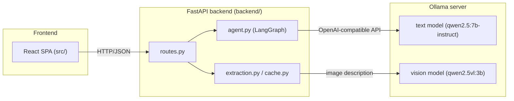
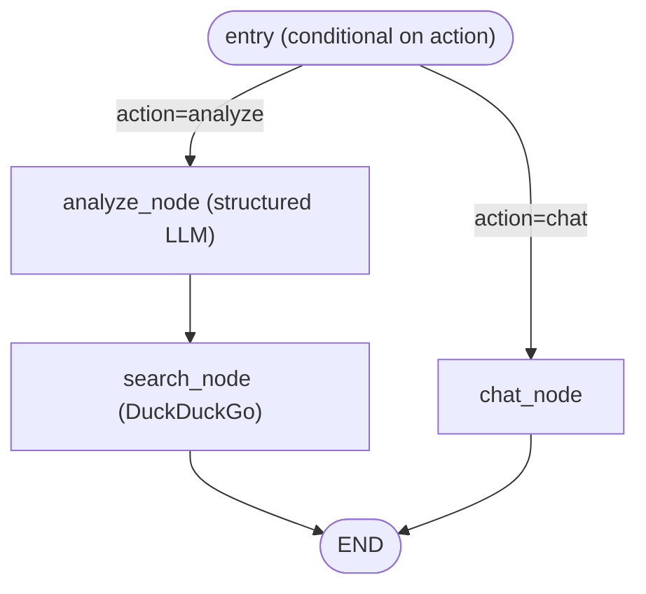

# Architecture

## Overview

OmniLearn AI is a two-tier app: a React SPA talks over HTTP/JSON to a FastAPI backend. The backend never calls a cloud LLM API — all generation and vision inference goes through a local **Ollama** server, accessed via LangChain's OpenAI-compatible client. **LangGraph** orchestrates the multi-step agent behavior (analyze vs. chat) as an explicit state graph rather than ad-hoc branching.



## Backend layers

### `main.py` — app wiring
Creates the FastAPI app, adds permissive CORS for the Vite dev server, and installs two exception handlers so any `HTTPException` or unhandled exception is returned as a plain-text error body (the frontend surfaces this text directly to the user — see `src/api.ts`).

### `routes.py` — HTTP surface
Four endpoints, each a thin adapter over `extraction`, `cache`, and the `agent` graph:

- **`POST /api/analyze`** — takes `{url, content_type}`, calls `extraction.fetch_from_url`, stores the extracted text in `cache`, then invokes the LangGraph agent in `"analyze"` mode.
- **`POST /api/analyze/upload`** — same, but for a directly uploaded file (`multipart/form-data`). Only content types in `UPLOADABLE_TYPES` (PDF, Audio, Image) are accepted here; the extracted text is cached under a synthetic `upload:<uuid>` key since there's no real URL to re-fetch from later.
- **`POST /api/chat`** — takes `{query, source_url, content_type, chat_history}`, resolves the cached context for that source (re-fetching from the URL if the process was restarted and the cache is cold — except for uploads, which fail with a "please re-upload" error since there's no URL to recover from), and invokes the agent in `"chat"` mode.
- **`GET /api/health`** — trivial liveness check.

### `extraction.py` — turning arbitrary content into plain text
The text model in Ollama is text-only, so every content type is normalized to plain text *before* it reaches the LLM:

| Content type | Extraction method |
|---|---|
| PDF Document | `PyMuPDF` (`fitz`) — direct text extraction, no GPU |
| Audio File | `faster-whisper` transcription (lazily loaded, `int8` compute, GPU auto-detected) |
| Image | POSTs the base64 image to Ollama's `/api/generate` with the vision model, asking for a verbatim transcription plus a description thorough enough that someone who can't see the image could still learn from it |
| YouTube Video | `youtube-transcript-api`, video ID parsed from the URL |
| ZIP Archive | Unzipped in-memory; only `.txt/.md/.csv/.json/.py/.js/.html` members are concatenated into one text blob |
| Google Drive file/folder | Downloaded via `gdown`, then routed through the same PDF/Audio/Image/ZIP handling as above |

All downloads go through a temp file that is always deleted (`finally: os.remove(...)`), even on extraction failure. Every extraction path returns a `(data, error)` tuple rather than raising, so `routes.py` can turn extraction failures into clean 400 responses instead of 500s.

### `cache.py` — per-source content cache
HTTP is stateless, but re-fetching a PDF/re-transcribing audio on every chat turn would be wasteful and slow. This is a simple process-local `dict` keyed by `f"{content_type}::{url}"`. It exists purely to avoid redundant extraction within one server run — it is **not** persisted, and uploads (no real URL) are unrecoverable across a restart by design.

### `agent.py` — the LangGraph agent
This is the core orchestration layer. State is a single `TypedDict` (`AgentState`) threaded through every node:

```python
class AgentState(TypedDict):
    action: str              # "analyze" | "chat"
    context_data: Any        # extracted plain text for the source
    study_guide: dict
    recommendations: dict
    chat_history: list
    user_query: str
    chat_response: str
```

**Graph shape:**



- **`analyze_content_node`** — binds the LLM to the `StudyGuide` Pydantic schema via `.with_structured_output()` and asks for a summary, 3–5 topics, and a randomly chosen 5–10 quiz questions in one shot. Structured output means the response is guaranteed parseable — no manual JSON-parsing/retry logic needed.
- **`web_search_node`** — for the first 3 topics from the study guide, runs a DuckDuckGo text search (`duckduckgo-search`) for `"{topic} educational tutorial"` and collects up to 2 results per topic. Wrapped in a bare `except: pass` per topic so one flaky search doesn't fail the whole analysis.
- **`chat_node`** — rebuilds the conversation as LangChain messages: a system prompt constraining answers to the provided material, a `HumanMessage` carrying up to the first 20,000 chars of context, the replayed `chat_history`, then the new `user_query`. `_stringify_content` normalizes the response, since some models can return `AIMessage.content` as a list of content parts instead of a plain string.
- **Routing** — `set_conditional_entry_point(route_action, ...)` picks `analyze_node` or `chat_node` as the entry based on `state["action"]`; there's no shared entry logic beyond that dispatch.

The compiled `graph` is a module-level singleton reused across requests; `routes.py` calls `graph.invoke(state)` synchronously per request (no cross-request state — everything needed is threaded through the input `state`).

### `schemas.py` / `config.py`
`schemas.py` holds the Pydantic models: `QuizQuestion` and `StudyGuide` (the LLM's structured-output target), plus the request/response DTOs for the three POST endpoints. `config.py` centralizes all env-driven settings — Ollama URL/models, Whisper model/device, the `ContentType` literal union, which content types support direct upload, file extension mapping, and CORS origins — loaded via `python-dotenv`.

## Frontend

Single-page React app, no router or global state library — everything lives in `App.tsx`'s `useState` and is passed down as props.

- **`Sidebar.tsx`** — lets the user pick a content type and either paste a URL or upload a file; calls `onProcess`.
- **`App.tsx`** — owns `studyGuide`, `recommendations`, `chatHistory`, the active tab, and loading/error state. `handleProcess` calls `analyzeContent`/`analyzeUpload` and stores the resulting `source_id`/URL for later chat calls; `handleChat` appends to `chatHistory` optimistically and calls `sendChatMessage`.
- **`StudyGuideTab.tsx`** / **`QuizTab.tsx`** / **`ChatTab.tsx`** — render the three post-analysis views (summary+recommendations, interactive quiz, tutor chat).
- **`WelcomeScreen.tsx`** — shown before any content has been analyzed.
- **`api.ts`** — thin `fetch` wrappers; on a non-OK response, the plain-text error body from the backend's exception handlers is thrown as an `Error` and surfaced directly in the UI.

## Data flow

**Analyze (URL):**
`Sidebar → App.handleProcess → api.analyzeContent → POST /api/analyze → extraction.fetch_from_url → cache.store → agent.graph (analyze_node → search_node) → { study_guide, recommendations } → App state → StudyGuideTab/QuizTab`

**Analyze (upload):**
Same, but via `POST /api/analyze/upload`; the backend returns a synthetic `source_id` (`upload:<uuid>`) in place of a real URL, since there's nothing to re-fetch from.

**Chat:**
`ChatTab → App.handleChat → api.sendChatMessage → POST /api/chat → cache.get_context (re-extracting if cold, except for uploads) → agent.graph (chat_node) → { response } → ChatTab`

## Why this design

- **Local-only inference** (`OLLAMA_BASE_URL`, `run_ollama.sh`) — no per-token cost, content stays on infrastructure the user controls. The tradeoff is that a small local model can't natively read PDFs/audio/images the way a hosted multimodal API could, hence the dedicated `extraction.py` preprocessing step for every content type.
- **LangGraph over plain LangChain chains** — the graph shape makes the two distinct workflows (analyze-then-search vs. chat) explicit and independently extensible (e.g. adding a new node to the analyze path doesn't touch the chat path).
- **Structured output for the study guide** — guarantees a parseable `StudyGuide` object instead of prompting for JSON and hoping the model complies.
- **Process-local caches only** (`cache.py`, in-memory `_content_cache`, no DB) — appropriate for a single-server hackathon/demo deployment; would need a shared store (Redis, etc.) to survive restarts or scale beyond one process.
